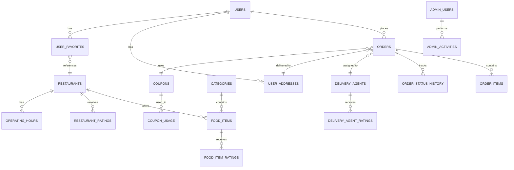

# QuickBite Database Schema

## Overview
This document describes the database schema for the QuickBite food delivery application. The schema is designed to support user authentication, restaurant management, food ordering, and admin operations.

---

## Entity Relationship Diagram



---

## Database Tables

### 1. USERS
**Purpose:** Store user account information

```sql
CREATE TABLE users (
    id VARCHAR(36) PRIMARY KEY,
    name VARCHAR(255) NOT NULL,
    email VARCHAR(255) NOT NULL UNIQUE,
    password_hash VARCHAR(255) NOT NULL,
    avatar VARCHAR(500),
    phone VARCHAR(20),
    status ENUM('active', 'inactive', 'banned') DEFAULT 'active',
    total_orders INT DEFAULT 0,
    total_spent DECIMAL(12, 2) DEFAULT 0.00,
    joined_at TIMESTAMP DEFAULT CURRENT_TIMESTAMP,
    last_login TIMESTAMP,
    created_at TIMESTAMP DEFAULT CURRENT_TIMESTAMP,
    updated_at TIMESTAMP DEFAULT CURRENT_TIMESTAMP ON UPDATE CURRENT_TIMESTAMP,
    deleted_at TIMESTAMP NULL
);

CREATE INDEX idx_users_email ON users(email);
CREATE INDEX idx_users_status ON users(status);
```

---

### 2. USER_ADDRESSES
**Purpose:** Store multiple delivery addresses for each user

```sql
CREATE TABLE user_addresses (
    id VARCHAR(36) PRIMARY KEY,
    user_id VARCHAR(36) NOT NULL,
    label VARCHAR(50), -- 'Home', 'Work', etc.
    street_address VARCHAR(255) NOT NULL,
    city VARCHAR(100) NOT NULL,
    state VARCHAR(100) NOT NULL,
    postal_code VARCHAR(20),
    country VARCHAR(100),
    latitude DECIMAL(10, 8),
    longitude DECIMAL(11, 8),
    is_default BOOLEAN DEFAULT FALSE,
    created_at TIMESTAMP DEFAULT CURRENT_TIMESTAMP,
    updated_at TIMESTAMP DEFAULT CURRENT_TIMESTAMP ON UPDATE CURRENT_TIMESTAMP,
    FOREIGN KEY (user_id) REFERENCES users(id) ON DELETE CASCADE
);

CREATE INDEX idx_user_addresses_user_id ON user_addresses(user_id);
CREATE INDEX idx_user_addresses_default ON user_addresses(user_id, is_default);
```

---

### 3. RESTAURANTS
**Purpose:** Store restaurant information

```sql
CREATE TABLE restaurants (
    id VARCHAR(36) PRIMARY KEY,
    name VARCHAR(255) NOT NULL,
    description TEXT,
    image VARCHAR(500),
    cuisine VARCHAR(100), -- 'Italian', 'Chinese', etc.
    rating DECIMAL(3, 2) DEFAULT 0.00,
    review_count INT DEFAULT 0,
    delivery_time VARCHAR(50), -- '30-45 mins'
    delivery_fee DECIMAL(8, 2) DEFAULT 0.00,
    price_range ENUM('$', '$$', '$$$', '$$$$') DEFAULT '$$',
    is_popular BOOLEAN DEFAULT FALSE,
    status ENUM('open', 'closed') DEFAULT 'closed',
    is_approved BOOLEAN DEFAULT FALSE,
    total_orders INT DEFAULT 0,
    total_revenue DECIMAL(15, 2) DEFAULT 0.00,
    owner_id VARCHAR(36),
    phone VARCHAR(20),
    email VARCHAR(255),
    street_address VARCHAR(255),
    city VARCHAR(100),
    state VARCHAR(100),
    postal_code VARCHAR(20),
    latitude DECIMAL(10, 8),
    longitude DECIMAL(11, 8),
    created_at TIMESTAMP DEFAULT CURRENT_TIMESTAMP,
    updated_at TIMESTAMP DEFAULT CURRENT_TIMESTAMP ON UPDATE CURRENT_TIMESTAMP,
    deleted_at TIMESTAMP NULL
);

CREATE INDEX idx_restaurants_cuisine ON restaurants(cuisine);
CREATE INDEX idx_restaurants_status ON restaurants(status);
CREATE INDEX idx_restaurants_approved ON restaurants(is_approved);
CREATE INDEX idx_restaurants_popular ON restaurants(is_popular);
CREATE INDEX idx_restaurants_rating ON restaurants(rating DESC);
```

---

### 4. CATEGORIES
**Purpose:** Store food item categories

```sql
CREATE TABLE categories (
    id VARCHAR(36) PRIMARY KEY,
    name VARCHAR(100) NOT NULL UNIQUE,
    description TEXT,
    icon VARCHAR(500),
    display_order INT DEFAULT 0,
    is_active BOOLEAN DEFAULT TRUE,
    created_at TIMESTAMP DEFAULT CURRENT_TIMESTAMP,
    updated_at TIMESTAMP DEFAULT CURRENT_TIMESTAMP ON UPDATE CURRENT_TIMESTAMP
);

CREATE INDEX idx_categories_active ON categories(is_active);
CREATE INDEX idx_categories_order ON categories(display_order);
```

---

### 5. FOOD_ITEMS
**Purpose:** Store menu items for restaurants

```sql
CREATE TABLE food_items (
    id VARCHAR(36) PRIMARY KEY,
    restaurant_id VARCHAR(36) NOT NULL,
    category_id VARCHAR(36) NOT NULL,
    name VARCHAR(255) NOT NULL,
    description TEXT,
    price DECIMAL(10, 2) NOT NULL,
    image VARCHAR(500),
    rating DECIMAL(3, 2) DEFAULT 0.00,
    review_count INT DEFAULT 0,
    is_popular BOOLEAN DEFAULT FALSE,
    is_vegetarian BOOLEAN DEFAULT FALSE,
    is_vegan BOOLEAN DEFAULT FALSE,
    is_gluten_free BOOLEAN DEFAULT FALSE,
    availability ENUM('available', 'unavailable', 'out_of_stock') DEFAULT 'available',
    orders_count INT DEFAULT 0,
    created_at TIMESTAMP DEFAULT CURRENT_TIMESTAMP,
    updated_at TIMESTAMP DEFAULT CURRENT_TIMESTAMP ON UPDATE CURRENT_TIMESTAMP,
    deleted_at TIMESTAMP NULL,
    FOREIGN KEY (restaurant_id) REFERENCES restaurants(id) ON DELETE CASCADE,
    FOREIGN KEY (category_id) REFERENCES categories(id) ON DELETE RESTRICT
);

CREATE INDEX idx_food_items_restaurant_id ON food_items(restaurant_id);
CREATE INDEX idx_food_items_category_id ON food_items(category_id);
CREATE INDEX idx_food_items_popular ON food_items(is_popular);
CREATE INDEX idx_food_items_availability ON food_items(availability);
```

---

### 6. ORDERS
**Purpose:** Store order information

```sql
CREATE TABLE orders (
    id VARCHAR(36) PRIMARY KEY,
    user_id VARCHAR(36) NOT NULL,
    restaurant_id VARCHAR(36) NOT NULL,
    delivery_address_id VARCHAR(36),
    delivery_agent_id VARCHAR(36),
    coupon_id VARCHAR(36),
    subtotal DECIMAL(12, 2) NOT NULL,
    delivery_fee DECIMAL(8, 2) DEFAULT 0.00,
    discount_amount DECIMAL(12, 2) DEFAULT 0.00,
    tax_amount DECIMAL(12, 2) DEFAULT 0.00,
    total_amount DECIMAL(12, 2) NOT NULL,
    payment_method ENUM('credit_card', 'debit_card', 'digital_wallet', 'cash') DEFAULT 'cash',
    payment_status ENUM('pending', 'completed', 'failed', 'refunded') DEFAULT 'pending',
    order_status ENUM('pending', 'confirmed', 'preparing', 'ready', 'on_the_way', 'delivered', 'cancelled') DEFAULT 'pending',
    special_instructions TEXT,
    estimated_delivery_time TIMESTAMP,
    actual_delivery_time TIMESTAMP,
    rating_given BOOLEAN DEFAULT FALSE,
    created_at TIMESTAMP DEFAULT CURRENT_TIMESTAMP,
    updated_at TIMESTAMP DEFAULT CURRENT_TIMESTAMP ON UPDATE CURRENT_TIMESTAMP,
    deleted_at TIMESTAMP NULL,
    FOREIGN KEY (user_id) REFERENCES users(id) ON DELETE RESTRICT,
    FOREIGN KEY (restaurant_id) REFERENCES restaurants(id) ON DELETE RESTRICT,
    FOREIGN KEY (delivery_address_id) REFERENCES user_addresses(id),
    FOREIGN KEY (delivery_agent_id) REFERENCES delivery_agents(id),
    FOREIGN KEY (coupon_id) REFERENCES coupons(id)
);

CREATE INDEX idx_orders_user_id ON orders(user_id);
CREATE INDEX idx_orders_restaurant_id ON orders(restaurant_id);
CREATE INDEX idx_orders_delivery_agent_id ON orders(delivery_agent_id);
CREATE INDEX idx_orders_status ON orders(order_status);
CREATE INDEX idx_orders_created_at ON orders(created_at DESC);
```

---

### 7. ORDER_ITEMS
**Purpose:** Store items in each order

```sql
CREATE TABLE order_items (
    id VARCHAR(36) PRIMARY KEY,
    order_id VARCHAR(36) NOT NULL,
    food_item_id VARCHAR(36) NOT NULL,
    quantity INT NOT NULL DEFAULT 1,
    unit_price DECIMAL(10, 2) NOT NULL,
    item_total DECIMAL(12, 2) NOT NULL,
    special_instructions TEXT,
    created_at TIMESTAMP DEFAULT CURRENT_TIMESTAMP,
    FOREIGN KEY (order_id) REFERENCES orders(id) ON DELETE CASCADE,
    FOREIGN KEY (food_item_id) REFERENCES food_items(id) ON DELETE RESTRICT
);

CREATE INDEX idx_order_items_order_id ON order_items(order_id);
CREATE INDEX idx_order_items_food_item_id ON order_items(food_item_id);
```

---

### 8. ORDER_STATUS_HISTORY
**Purpose:** Track order status changes over time

```sql
CREATE TABLE order_status_history (
    id VARCHAR(36) PRIMARY KEY,
    order_id VARCHAR(36) NOT NULL,
    old_status VARCHAR(50),
    new_status VARCHAR(50) NOT NULL,
    changed_by VARCHAR(36), -- user_id or admin_id
    reason TEXT,
    created_at TIMESTAMP DEFAULT CURRENT_TIMESTAMP,
    FOREIGN KEY (order_id) REFERENCES orders(id) ON DELETE CASCADE
);

CREATE INDEX idx_order_status_history_order_id ON order_status_history(order_id);
```

---

### 9. DELIVERY_AGENTS
**Purpose:** Store delivery partner information

```sql
CREATE TABLE delivery_agents (
    id VARCHAR(36) PRIMARY KEY,
    name VARCHAR(255) NOT NULL,
    email VARCHAR(255) NOT NULL UNIQUE,
    password_hash VARCHAR(255) NOT NULL,
    phone VARCHAR(20) NOT NULL,
    avatar VARCHAR(500),
    vehicle_type ENUM('bike', 'scooter', 'car') DEFAULT 'bike',
    vehicle_number VARCHAR(50),
    rating DECIMAL(3, 2) DEFAULT 0.00,
    review_count INT DEFAULT 0,
    total_deliveries INT DEFAULT 0,
    status ENUM('online', 'offline', 'on_delivery', 'break') DEFAULT 'offline',
    current_latitude DECIMAL(10, 8),
    current_longitude DECIMAL(11, 8),
    is_verified BOOLEAN DEFAULT FALSE,
    is_active BOOLEAN DEFAULT TRUE,
    bank_account_number VARCHAR(50),
    bank_ifsc_code VARCHAR(20),
    total_earnings DECIMAL(15, 2) DEFAULT 0.00,
    created_at TIMESTAMP DEFAULT CURRENT_TIMESTAMP,
    updated_at TIMESTAMP DEFAULT CURRENT_TIMESTAMP ON UPDATE CURRENT_TIMESTAMP,
    last_active TIMESTAMP
);

CREATE INDEX idx_delivery_agents_status ON delivery_agents(status);
CREATE INDEX idx_delivery_agents_verified ON delivery_agents(is_verified);
CREATE INDEX idx_delivery_agents_active ON delivery_agents(is_active);
```

---

### 10. DELIVERY_AGENT_RATINGS
**Purpose:** Store ratings for delivery agents

```sql
CREATE TABLE delivery_agent_ratings (
    id VARCHAR(36) PRIMARY KEY,
    delivery_agent_id VARCHAR(36) NOT NULL,
    order_id VARCHAR(36) NOT NULL,
    user_id VARCHAR(36) NOT NULL,
    rating INT CHECK (rating >= 1 AND rating <= 5),
    review TEXT,
    created_at TIMESTAMP DEFAULT CURRENT_TIMESTAMP,
    FOREIGN KEY (delivery_agent_id) REFERENCES delivery_agents(id) ON DELETE CASCADE,
    FOREIGN KEY (order_id) REFERENCES orders(id) ON DELETE CASCADE,
    FOREIGN KEY (user_id) REFERENCES users(id) ON DELETE CASCADE,
    UNIQUE (order_id) -- One rating per order
);

CREATE INDEX idx_delivery_agent_ratings_agent_id ON delivery_agent_ratings(delivery_agent_id);
```

---

### 11. FOOD_ITEM_RATINGS
**Purpose:** Store ratings for food items

```sql
CREATE TABLE food_item_ratings (
    id VARCHAR(36) PRIMARY KEY,
    food_item_id VARCHAR(36) NOT NULL,
    order_id VARCHAR(36) NOT NULL,
    user_id VARCHAR(36) NOT NULL,
    rating INT CHECK (rating >= 1 AND rating <= 5),
    review TEXT,
    created_at TIMESTAMP DEFAULT CURRENT_TIMESTAMP,
    FOREIGN KEY (food_item_id) REFERENCES food_items(id) ON DELETE CASCADE,
    FOREIGN KEY (order_id) REFERENCES orders(id) ON DELETE CASCADE,
    FOREIGN KEY (user_id) REFERENCES users(id) ON DELETE CASCADE
);

CREATE INDEX idx_food_item_ratings_food_item_id ON food_item_ratings(food_item_id);
CREATE INDEX idx_food_item_ratings_user_id ON food_item_ratings(user_id);
```

---

### 12. RESTAURANT_RATINGS
**Purpose:** Store ratings for restaurants

```sql
CREATE TABLE restaurant_ratings (
    id VARCHAR(36) PRIMARY KEY,
    restaurant_id VARCHAR(36) NOT NULL,
    order_id VARCHAR(36) NOT NULL,
    user_id VARCHAR(36) NOT NULL,
    rating INT CHECK (rating >= 1 AND rating <= 5),
    review TEXT,
    created_at TIMESTAMP DEFAULT CURRENT_TIMESTAMP,
    FOREIGN KEY (restaurant_id) REFERENCES restaurants(id) ON DELETE CASCADE,
    FOREIGN KEY (order_id) REFERENCES orders(id) ON DELETE CASCADE,
    FOREIGN KEY (user_id) REFERENCES users(id) ON DELETE CASCADE,
    UNIQUE (order_id) -- One rating per order
);

CREATE INDEX idx_restaurant_ratings_restaurant_id ON restaurant_ratings(restaurant_id);
```

---

### 13. USER_FAVORITES
**Purpose:** Store user's favorite restaurants

```sql
CREATE TABLE user_favorites (
    id VARCHAR(36) PRIMARY KEY,
    user_id VARCHAR(36) NOT NULL,
    restaurant_id VARCHAR(36) NOT NULL,
    created_at TIMESTAMP DEFAULT CURRENT_TIMESTAMP,
    FOREIGN KEY (user_id) REFERENCES users(id) ON DELETE CASCADE,
    FOREIGN KEY (restaurant_id) REFERENCES restaurants(id) ON DELETE CASCADE,
    UNIQUE (user_id, restaurant_id) -- Prevent duplicate favorites
);

CREATE INDEX idx_user_favorites_user_id ON user_favorites(user_id);
```

---

### 14. COUPONS
**Purpose:** Store promotional coupons

```sql
CREATE TABLE coupons (
    id VARCHAR(36) PRIMARY KEY,
    code VARCHAR(50) NOT NULL UNIQUE,
    description TEXT,
    discount_type ENUM('fixed', 'percentage') DEFAULT 'fixed',
    discount_value DECIMAL(10, 2) NOT NULL,
    max_discount DECIMAL(10, 2), -- max discount cap for percentage
    min_order_value DECIMAL(10, 2) DEFAULT 0.00,
    max_usage INT DEFAULT -1, -- -1 for unlimited
    current_usage INT DEFAULT 0,
    usage_per_user INT DEFAULT 1,
    valid_from TIMESTAMP,
    valid_until TIMESTAMP,
    is_active BOOLEAN DEFAULT TRUE,
    created_by VARCHAR(36), -- admin_id
    created_at TIMESTAMP DEFAULT CURRENT_TIMESTAMP,
    updated_at TIMESTAMP DEFAULT CURRENT_TIMESTAMP ON UPDATE CURRENT_TIMESTAMP
);

CREATE INDEX idx_coupons_code ON coupons(code);
CREATE INDEX idx_coupons_active ON coupons(is_active);
CREATE INDEX idx_coupons_valid_period ON coupons(valid_from, valid_until);
```

---

### 15. COUPON_USAGE
**Purpose:** Track coupon usage history

```sql
CREATE TABLE coupon_usage (
    id VARCHAR(36) PRIMARY KEY,
    coupon_id VARCHAR(36) NOT NULL,
    user_id VARCHAR(36) NOT NULL,
    order_id VARCHAR(36) NOT NULL,
    discount_applied DECIMAL(12, 2),
    created_at TIMESTAMP DEFAULT CURRENT_TIMESTAMP,
    FOREIGN KEY (coupon_id) REFERENCES coupons(id) ON DELETE CASCADE,
    FOREIGN KEY (user_id) REFERENCES users(id) ON DELETE CASCADE,
    FOREIGN KEY (order_id) REFERENCES orders(id) ON DELETE CASCADE
);

CREATE INDEX idx_coupon_usage_coupon_id ON coupon_usage(coupon_id);
CREATE INDEX idx_coupon_usage_user_id ON coupon_usage(user_id);
```

---

### 16. OPERATING_HOURS
**Purpose:** Store restaurant operating hours

```sql
CREATE TABLE operating_hours (
    id VARCHAR(36) PRIMARY KEY,
    restaurant_id VARCHAR(36) NOT NULL,
    day_of_week ENUM('Monday', 'Tuesday', 'Wednesday', 'Thursday', 'Friday', 'Saturday', 'Sunday'),
    opening_time TIME NOT NULL,
    closing_time TIME NOT NULL,
    is_closed BOOLEAN DEFAULT FALSE,
    created_at TIMESTAMP DEFAULT CURRENT_TIMESTAMP,
    updated_at TIMESTAMP DEFAULT CURRENT_TIMESTAMP ON UPDATE CURRENT_TIMESTAMP,
    FOREIGN KEY (restaurant_id) REFERENCES restaurants(id) ON DELETE CASCADE,
    UNIQUE (restaurant_id, day_of_week)
);

CREATE INDEX idx_operating_hours_restaurant_id ON operating_hours(restaurant_id);
```

---

### 17. ADMIN_USERS
**Purpose:** Store admin user information

```sql
CREATE TABLE admin_users (
    id VARCHAR(36) PRIMARY KEY,
    name VARCHAR(255) NOT NULL,
    email VARCHAR(255) NOT NULL UNIQUE,
    password_hash VARCHAR(255) NOT NULL,
    role ENUM('super_admin', 'admin', 'moderator') DEFAULT 'admin',
    avatar VARCHAR(500),
    permissions JSON, -- Store as JSON array for flexibility
    is_active BOOLEAN DEFAULT TRUE,
    last_login TIMESTAMP,
    created_at TIMESTAMP DEFAULT CURRENT_TIMESTAMP,
    updated_at TIMESTAMP DEFAULT CURRENT_TIMESTAMP ON UPDATE CURRENT_TIMESTAMP
);

CREATE INDEX idx_admin_users_email ON admin_users(email);
CREATE INDEX idx_admin_users_role ON admin_users(role);
CREATE INDEX idx_admin_users_active ON admin_users(is_active);
```

---

### 18. ADMIN_ACTIVITIES
**Purpose:** Audit log for admin activities

```sql
CREATE TABLE admin_activities (
    id VARCHAR(36) PRIMARY KEY,
    admin_id VARCHAR(36) NOT NULL,
    action VARCHAR(100) NOT NULL,
    entity_type VARCHAR(100), -- 'restaurant', 'user', 'order', etc.
    entity_id VARCHAR(36),
    old_values JSON,
    new_values JSON,
    ip_address VARCHAR(45),
    user_agent TEXT,
    created_at TIMESTAMP DEFAULT CURRENT_TIMESTAMP,
    FOREIGN KEY (admin_id) REFERENCES admin_users(id) ON DELETE RESTRICT
);

CREATE INDEX idx_admin_activities_admin_id ON admin_activities(admin_id);
CREATE INDEX idx_admin_activities_created_at ON admin_activities(created_at DESC);
CREATE INDEX idx_admin_activities_entity ON admin_activities(entity_type, entity_id);
```

---

### 19. NOTIFICATIONS
**Purpose:** Store user and system notifications

```sql
CREATE TABLE notifications (
    id VARCHAR(36) PRIMARY KEY,
    user_id VARCHAR(36),
    delivery_agent_id VARCHAR(36),
    admin_id VARCHAR(36),
    type VARCHAR(50), -- 'order_update', 'promotion', 'system', etc.
    title VARCHAR(255) NOT NULL,
    message TEXT NOT NULL,
    related_entity_type VARCHAR(50), -- 'order', 'restaurant', etc.
    related_entity_id VARCHAR(36),
    is_read BOOLEAN DEFAULT FALSE,
    action_url VARCHAR(500),
    created_at TIMESTAMP DEFAULT CURRENT_TIMESTAMP,
    read_at TIMESTAMP NULL,
    CHECK (user_id IS NOT NULL OR delivery_agent_id IS NOT NULL OR admin_id IS NOT NULL)
);

CREATE INDEX idx_notifications_user_id ON notifications(user_id, is_read);
CREATE INDEX idx_notifications_delivery_agent_id ON notifications(delivery_agent_id);
CREATE INDEX idx_notifications_created_at ON notifications(created_at DESC);
```

---

### 20. REVENUE_STATISTICS
**Purpose:** Store aggregated revenue data

```sql
CREATE TABLE revenue_statistics (
    id VARCHAR(36) PRIMARY KEY,
    month_year DATE NOT NULL UNIQUE, -- First day of the month
    total_revenue DECIMAL(15, 2) DEFAULT 0.00,
    total_orders INT DEFAULT 0,
    total_users INT DEFAULT 0,
    average_order_value DECIMAL(12, 2),
    total_refunds DECIMAL(15, 2) DEFAULT 0.00,
    commission_earned DECIMAL(15, 2) DEFAULT 0.00,
    created_at TIMESTAMP DEFAULT CURRENT_TIMESTAMP,
    updated_at TIMESTAMP DEFAULT CURRENT_TIMESTAMP ON UPDATE CURRENT_TIMESTAMP
);

CREATE INDEX idx_revenue_statistics_month_year ON revenue_statistics(month_year);
```

---

## Data Types Reference

| Database Type | Purpose |
|---|---|
| `VARCHAR(n)` | Variable-length strings |
| `EMAIL` | Email addresses |
| `TEXT` | Long text data (descriptions, reviews) |
| `INT` | Integer counters |
| `DECIMAL(p,s)` | Monetary values (price, total) |
| `ENUM` | Fixed set of values |
| `BOOLEAN` | True/false flags |
| `TIMESTAMP` | Date and time |
| `JSON` | Flexible nested data |
| `DECIMAL(10, 8)` | GPS coordinates (latitude) |
| `DECIMAL(11, 8)` | GPS coordinates (longitude) |

---

## Key Design Decisions

### 1. **UUID Primary Keys**
- All tables use UUID (36 character strings) as primary keys
- Enables distributed generation without coordination

### 2. **Soft Deletes**
- User and Restaurant tables include `deleted_at` TIMESTAMP
- Supports auditing and recovery while maintaining data integrity

### 3. **Timestamps**
- `created_at` and `updated_at` on most tables for audit trails
- Automatic timestamps on creation and modification

### 4. **Order Status Workflow**
- Order lifecycle: pending → confirmed → preparing → ready → on_the_way → delivered
- Status history table tracks all transitions

### 5. **Rating System**
- Separate tables for different rating types (food, restaurant, delivery agent)
- Prevents duplicate ratings per order

### 6. **Soft Dependencies**
- User-favorite relationships stored in separate table for flexibility
- Cart items not persisted (calculated in memory during session)

### 7. **Audit Trail**
- Admin activities logged in `admin_activities` table
- Complete history of all administrative changes

---

## Indexes Strategy

### Performance Indexes
- **Lookup optimizations**: `email`, `code`, `status` fields
- **Range queries**: `created_at`, `month_year`
- **Join optimization**: All foreign key columns indexed
- **Filter optimization**: `is_active`, `is_approved` flags

---

## Constraints & Validations

```sql
-- User email uniqueness
UNIQUE KEY (email)

-- Coupon code uniqueness
UNIQUE KEY (code)

-- Prevent duplicate ratings
UNIQUE KEY (order_id) in rating tables

-- Prevent duplicate favorites
UNIQUE KEY (user_id, restaurant_id)

-- Rating value bounds
CHECK (rating >= 1 AND rating <= 5)

-- Price constraints
CHECK (price > 0)
CHECK (total_amount >= 0)

-- Enum validations
CHECK (status IN ('active', 'inactive', 'banned'))
CHECK (order_status IN ('pending', 'confirmed', 'preparing', 'ready', 'on_the_way', 'delivered', 'cancelled'))
```

---

## Data Growth Estimates

| Table | Expected Records | Storage |
|---|---|---|
| users | 100,000 | ~50 MB |
| restaurants | 5,000 | ~5 MB |
| food_items | 50,000 | ~25 MB |
| orders | 500,000 | ~500 MB |
| order_items | 1,500,000 | ~300 MB |
| delivery_agents | 1,000 | ~1 MB |
| **TOTAL** | **~5M records** | **~1 GB** |

---

## Backup & Recovery Strategy

1. **Daily automated backups** at off-peak hours
2. **Point-in-time recovery** capability (30-day retention)
3. **Master-slave replication** for high availability
4. **Archive old records** after 2 years to separate storage

---

## Security Considerations

- ✅ Password fields hashed (SHA-256 or bcrypt)
- ✅ Sensitive data in separate tables with restricted access
- ✅ Audit trail for all admin activities
- ✅ IP address logging for suspicious activities
- ✅ Soft deletes to prevent permanent data loss
- ✅ Row-level security for sensitive operations

---

## Migration From Mobile App

The current Flutter app uses in-memory models. To migrate to this schema:

1. Map Dart models to database tables
2. Implement ORM/query builder (e.g., SQLAlchemy, Prisma)
3. Add API endpoints for all CRUD operations
4. Implement authentication & authorization
5. Add transaction support for order operations
6. Create admin panel routes

---

## Notes for Backend Development

- Implement **optimistic locking** for concurrent orders
- Use **database transactions** for multi-table operations
- Add **connection pooling** for performance
- Implement **caching layer** for frequently accessed data
- Use **analytical queries** for dashboard statistics
- Consider **sharding** if scaling beyond single server

---

*Last Updated: March 24, 2026*
*Version: 1.0*
